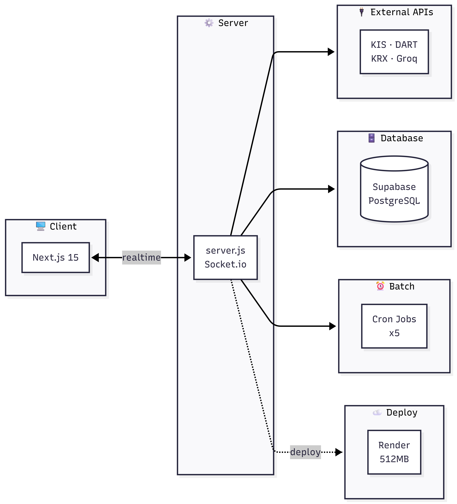
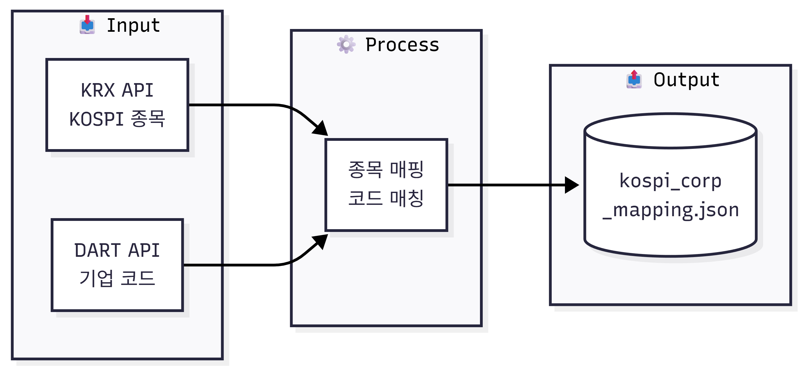
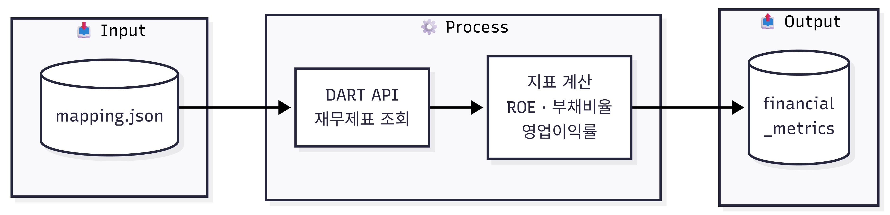
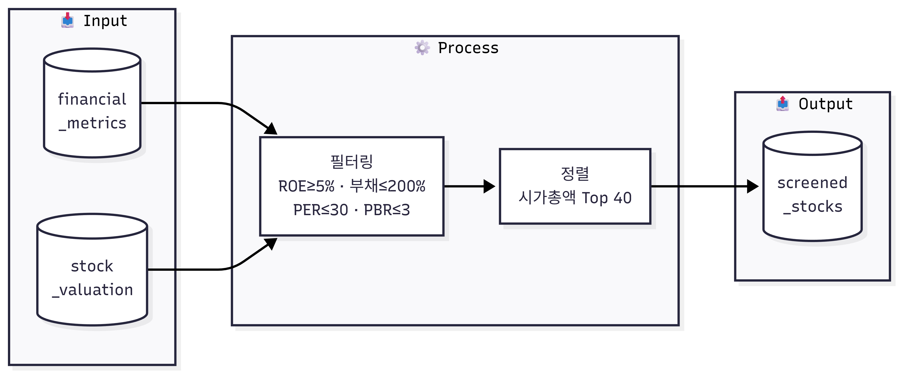
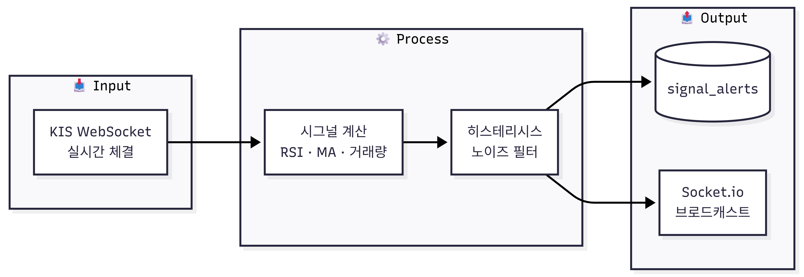
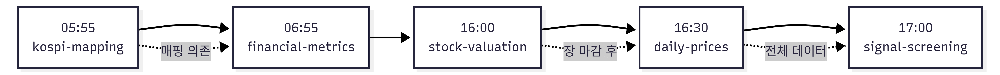

# InvestMate

KOSPI 주식 투자를 위한 풀스택 웹 플랫폼입니다.

## 프로젝트 소개

KOSPI 상장 종목의 투자 정보를 한 곳에서 확인할 수 있는 웹 플랫폼입니다.

- **실시간 시세**: 한국투자증권 WebSocket API로 체결가/호가 실시간 수신
- **재무 분석**: DART API에서 재무제표를 수집하여 ROE, 부채비율, 영업이익률 자동 계산
- **종목 스크리닝**: 펀더멘털 + 밸류에이션 기준으로 상위 40종목 자동 선별
- **공시 AI 요약**: DART 공시를 LLM으로 3-5문장 요약
- **매매 시그널**: RSI 과매도, 골든크로스, 거래량 급등 실시간 감지

**1인 기획/설계/개발**로 완성하여 Render에 배포했습니다.

## 주요 기능

| 기능          | 설명                                                    |
| ------------- | ------------------------------------------------------- |
| 실시간 시세   | 한국투자증권 WebSocket API 연동, Socket.io 브로드캐스트 |
| 종목 스크리닝 | ROE, 부채비율, PER, PBR 기반 필터링 (상위 40종목)       |
| 재무 분석     | DART API 연동, 재무지표 자동 수집                       |
| 공시 AI 요약  | DART 공시 On-demand Groq LLM 요약                       |
| 시그널 알림   | RSI 과매도, 골든크로스, 거래량 급등 감지                |
| 배치 자동화   | 5개 크론 잡으로 데이터 자동 수집/처리                   |

## 기술 스택

| 분류        | 기술                                                |
| ----------- | --------------------------------------------------- |
| Frontend    | Next.js 15, TypeScript, TailwindCSS, TanStack Query |
| Backend     | Node.js, Socket.io Server, node-cron                |
| Database    | Supabase (PostgreSQL)                               |
| 실시간 통신 | WebSocket (KIS API), Socket.io                      |
| 지표 계산   | technicalindicators (RSI, MA, 거래량)               |
| AI/LLM      | Groq SDK (Llama 3.1 8B)                             |
| 차트        | ECharts                                             |
| 배포        | Render                                              |

## 아키텍처



- **Client**: Next.js 15 (App Router) + Socket.io Client
- **Server**: Custom server.js에서 실시간 WebSocket 데이터 처리
- **External APIs**: KIS(시세), DART(재무/공시), KRX(종목), Groq(LLM)
- **Database**: Supabase (PostgreSQL)
- **Batch**: Cron Jobs 5개 (데이터 수집/스크리닝)
- **Deploy**: Render Starter (0.5 CPU, 512MB RAM)

## 시스템 동작 흐름

### 1. 종목 데이터 수집 (Daily)



1. KRX에서 KOSPI 상장 종목 리스트 수집
2. DART에서 전체 기업 코드 목록 조회
3. 종목코드 기준 매핑 (KOSPI 종목만 필터링)
4. `kospi_corp_mapping.json`에 저장
   - 900개+ 종목 처리 시 512MB 메모리 제약 → 청크 단위 fs 스트리밍으로 OOM 방지

### 2. 재무 데이터 수집 (Daily)



1. 매핑 파일에서 corp_code 목록 로드
2. DART 재무제표 API 호출 (기업별)
3. ROE, 부채비율, 영업이익률 계산
4. Supabase `financial_metrics` 테이블에 저장

### 3. 종목 스크리닝 (Daily)



**필터 조건:**

- ROE ≥ 5%, 부채비율 ≤ 200%, 영업이익률 ≥ 3%
- PER ≤ 30, PBR ≤ 3.0
- 시가총액 기준 상위 40종목 선별

### 4. 실시간 시그널 (Market Hours)



1. KIS WebSocket에서 실시간 체결가 수신
2. RSI, 이동평균, 거래량 계산
3. 히스테리시스 기반 시그널 감지
4. 새 시그널 발생 시 DB 저장 + Socket.io 브로드캐스트

### 5. 크론 잡 실행 순서



| 시간  | 잡                 | 의존성      |
| ----- | ------------------ | ----------- |
| 05:55 | kospi-mapping-sync | -           |
| 06:55 | financial-metrics  | 매핑 데이터 |
| 16:00 | stock-valuation    | 장 마감 후  |
| 16:30 | daily-prices       | 일봉 데이터 |
| 17:00 | signal-screening   | 전체 데이터 |

## 핵심 구현

### 1. 실시간 시세 (KIS WebSocket)

한국투자증권 WebSocket API를 연동하여 실시간 체결가를 수신합니다.

```typescript
// KIS WebSocket 메시지 파싱
private parseMessage(message: string): RealtimePrice {
  const parts = message.split("|");
  const fields = parts[3].split("^");

  return {
    stockCode: fields[0],     // 종목코드
    price: parseInt(fields[2]),       // 현재가
    change: parseInt(fields[4]),      // 전일대비
    volume: parseInt(fields[13])      // 거래량
  };
}
```

- 서버에서 KIS WebSocket 단일 연결
- 실시간 데이터를 Socket.io로 클라이언트에 브로드캐스트
- PINGPONG 메시지로 연결 유지
- 자동 재연결 (최대 5회)

### 2. 시그널 감지 (히스테리시스)

기술적 지표 기반 매매 시그널을 감지합니다. 히스테리시스로 노이즈를 방지합니다.

```typescript
// RSI 과매도 시그널 (히스테리시스)
if (prev.rsiOversold) {
  // 이미 과매도 상태: 35 이상일 때만 해제
  newRsiOversold = rsiValue < 35;
} else {
  // 정상 상태: 30 이하일 때만 진입
  newRsiOversold = rsiValue <= 30;
}

// 새 시그널 감지: false → true 전이만 알림
const isNewTrigger = !prev.rsiOversold && newRsiOversold;
```

| 시그널      | 진입 조건         | 해제 조건           |
| ----------- | ----------------- | ------------------- |
| RSI 과매도  | RSI ≤ 30          | RSI ≥ 35            |
| 골든크로스  | MA5 > MA20 (교차) | -                   |
| 거래량 급등 | 거래량 ≥ 평균×2배 | 거래량 ≤ 평균×1.5배 |

### 3. 종목 스크리닝

펀더멘털 + 밸류에이션 기준으로 종목을 필터링합니다.

```typescript
const SCREENING_CONFIG = {
  fundamental: {
    minROE: 5, // 자기자본이익률 ≥ 5%
    maxDebtRatio: 200, // 부채비율 ≤ 200%
    minOperatingMargin: 3, // 영업이익률 ≥ 3%
    maxPER: 30, // PER ≤ 30배
    maxPBR: 3.0, // PBR ≤ 3.0배
  },
  topN: 40, // 시가총액 상위 40개
};
```

### 4. 공시 AI 요약 (On-Demand)

DART 공시를 클릭 시점에 LLM으로 요약합니다.

```
사용자 공시 클릭
    ↓
DART에서 공시 원본 다운로드 (ZIP)
    ↓
HTML 본문 추출
    ↓
Groq LLM 요약 (3-5문장)
    ↓
React Query 캐싱 (30분)
```

**On-Demand 설계 이유:**

- LLM API 비용 절감
- Groq RPM 제한 대응
- 사용자가 원하는 공시만 요약

### 5. 크론 잡 시스템

5개 배치 작업이 주식 시장 시간에 맞춰 자동 실행됩니다.

| 시간         | 잡                 | 설명                   |
| ------------ | ------------------ | ---------------------- |
| 05:55        | kospi-mapping-sync | 종목 매핑 동기화 (KRX) |
| 06:55, 18:55 | financial-metrics  | 재무지표 수집 (DART)   |
| 16:00        | stock-valuation    | PER/PBR 계산 (KIS)     |
| 16:30        | daily-prices       | 일봉 데이터 수집 (KIS) |
| 17:00        | signal-screening   | 스크리닝 실행          |

### 6. 디자인 토큰 시스템

KRDS 기반 디자인 토큰을 JSON으로 정의하고, 빌드 시 여러 포맷으로 변환합니다.

```
src/styles/
├── tokens/krds.json        # 토큰 정의 (color, typo, spacing)
└── scripts/
    ├── build-tokens.js     # 빌드 엔트리
    └── formatters/
        ├── css.js          # → CSS Variables
        ├── javascript.js   # → JS Constants
        └── tailwind.js     # → Tailwind Config
```

- Light / Dark / High-contrast 테마 지원
- `npm run build:styles`로 토큰 빌드 (dev/build 시 자동 실행)

### 7. 중앙화된 HTTP 클라이언트

Axios 없이 native fetch 기반으로 구현한 HTTP 추상화 레이어입니다.
모든 API 요청이 단일 진입점을 통해 처리되며, 공통 로직을 한 곳에서 관리합니다.

```typescript
// 팩토리 패턴으로 클라이언트 생성
export function createHttpClient(config: {
  requestInterceptors?: RequestInterceptor[];
  responseInterceptors?: ResponseInterceptor[];
  responseParser: ResponseParser;
}) { ... }

// 특화된 클라이언트 인스턴스
export const jsonHttpClient = createHttpClient({
  responseParser: jsonResponseParser,
});
```

- **팩토리 패턴**: 설정 기반 클라이언트 생성
- **Interceptor 체인**: Request/Response 전처리
- **Next.js 캐싱 통합**: `revalidate`, `tags` 옵션 지원

### 8. 백엔드 레이어 구조 (src/core)

```
entities/        → 도메인 엔티티 (타입 정의)
services/        → 비즈니스 로직 (단일 책임)
infrastructure/  → 외부 연동 (DB, API 클라이언트)
workflows/       → 오케스트레이션 (복합 작업 흐름)
```

- 의존성 방향: `infrastructure → services → entities`
- workflows는 여러 서비스를 조합하여 크론 잡/API에서 호출

## 디렉토리 구조

```
src/
├── app/
│   ├── api/                      # REST API Routes
│   │   ├── stocks/               # 종목 데이터
│   │   ├── financial/            # 재무지표
│   │   ├── disclosures/          # DART 공시 + AI 요약
│   │   ├── screened-stocks/      # 선별 종목
│   │   └── signal-alerts/        # 시그널 알림
│   ├── screener/                 # 스크리너 페이지
│   └── page.tsx                  # 메인 대시보드
│
├── core/                         # 백엔드 비즈니스 로직
│   ├── cron/jobs/                # 5개 크론 잡
│   ├── entities/                 # 도메인 엔티티
│   ├── infrastructure/           # 외부 API 연동
│   │   ├── market/               # KIS API
│   │   ├── financial/            # DART API
│   │   └── common/               # Supabase, LLM
│   ├── services/                 # 비즈니스 서비스
│   └── workflows/                # 복합 작업 흐름
│
├── components/                   # React 컴포넌트
│   ├── dashboard/                # 대시보드 UI
│   └── stockChart/               # 차트 컴포넌트
│
├── hooks/                        # Custom Hooks
│   ├── useRealtimePrice.ts       # 실시간 가격
│   ├── useScreenedStocks.ts      # 선별 종목
│   └── useDisclosures.ts         # 공시 + AI 요약
│
└── shared/
    └── providers/
        └── SocketProvider.tsx    # Socket.io Context
```

## 데이터베이스 스키마

| 테이블            | 용도              |
| ----------------- | ----------------- |
| screened_stocks   | 선별 종목 (40개)  |
| financial_metrics | 재무지표 (분기별) |
| daily_prices      | 일봉 데이터       |
| stock_valuation   | PER/PBR           |
| signal_alerts     | 시그널 알림       |

## 실행 방법

```bash
# 의존성 설치
npm install

# 개발 서버 실행
npm run dev

# 프로덕션 빌드
npm run build

# 프로덕션 실행
npm start

# 테스트
npm test
```

## 환경 변수

```bash
# Supabase
SUPABASE_URL=
SUPABASE_SERVICE_ROLE_KEY=

# KIS (한국투자증권)
KIS_BASE_URL=
KIS_APP_KEY=
KIS_APP_SECRET=

# DART
DART_APP_KEY=

# LLM
GROQ_API_KEY=

# 크론 활성화
CRON_ENABLED=true
```

## 기술 스택

- TypeScript
- Next.js 15
- TanStack Query
- Supabase
- Socket.io
- node-cron
- technicalindicators
- Groq SDK
- ECharts
- Vitest
